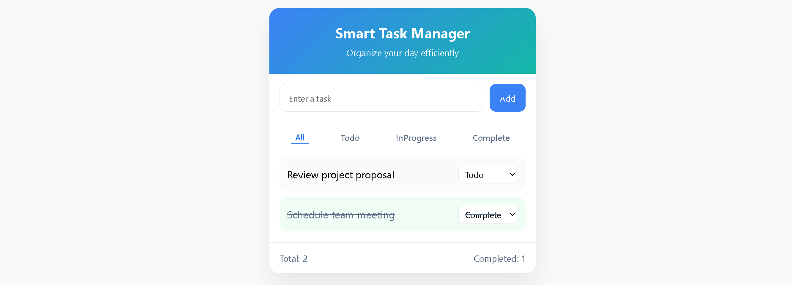

# Smart Task Manager (Vanilla JavaScript)

A clean, responsive, and performance-optimized **task management application** built using **HTML, CSS, and Vanilla JavaScript** — without any external libraries or frameworks.

This project focuses on real-world frontend fundamentals such as DOM manipulation, event handling, UI state management, performance optimization, and memory-leak prevention.

---

## 🚀 Features

### ✅ Task Management
- Add new tasks
- Update task status (Todo / InProgress / Complete)
- Live task counters (Total / Completed)
- Visual indicators for task states

### 🔍 Search with Debounce
- Search tasks by title
- Debounced input handling for better performance
- Handles edge cases:
  - No tasks available
  - No matching search results
- Search state resets correctly when new tasks are added

### 🎯 Filters
- Filter tasks by status:
  - All
  - Todo
  - InProgress
  - Complete
- Filters work together with search results

### 📜 Scroll Handling with Throttle
- Throttled scroll listener for smooth scrolling
- Detects when user reaches the bottom of the task list
- Scroll listener is properly cleaned up

### 🧹 Memory Leak Prevention
- Event listeners are removed on page unload
- Dedicated cleanup functions for:
  - Search input listener
  - Scroll listener
- Safe DOM access and defensive checks

### 📱 UI & UX
- Mobile-first responsive layout
- Clean and minimal design
- Clear empty states with user-friendly messages

---

## 🛠️ Tech Stack

- **HTML5**
- **CSS3**
  - Flexbox
  - Responsive design
- **Vanilla JavaScript (ES6+)**
  - DOM manipulation
  - Debounce & throttle utilities
  - Event delegation
  - UI state management

---

## 📸 UI Preview

---

## 🧠 What I Learned

- Core DOM selection and manipulation
- Debounce vs Throttle and their real-world use cases
- Managing UI state without frameworks
- Handling edge cases in dynamic interfaces
- Preventing memory leaks in JavaScript applications
- Writing clean, maintainable, and scalable frontend code

---

## 📌 Why This Project

This project is intentionally built **without any libraries or frameworks** to strengthen core JavaScript fundamentals and demonstrate how production-level behavior (performance optimization, cleanup, lifecycle handling) can be achieved using plain JavaScript.

---

## 🔚 Conclusion

**Smart Task Manager** is a practical example of a real-world Vanilla JavaScript application, suitable for:
- Frontend interviews
- Learning advanced JavaScript concepts
- Understanding how modern frameworks manage state and lifecycle internally

---
